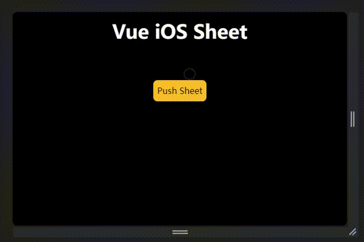

# Vue iOS Sheet



## Install

```bash
pnpm install vue-ios-sheet
```

## Usage

```vue
<script setup>
import { SheetWrapper, pushSheet } from '../../dist'
import Sheet from './Sheet.vue'
</script>

<template>
  <SheetWrapper>
    <button
      @click="() => {
        pushSheet(Sheet) // any component
      }"
    >
      Push Sheet
    </button>
  </SheetWrapper>
</template>
```

## Development

```bash
pnpm install -r
pnpm build
pnpm run dev
```
